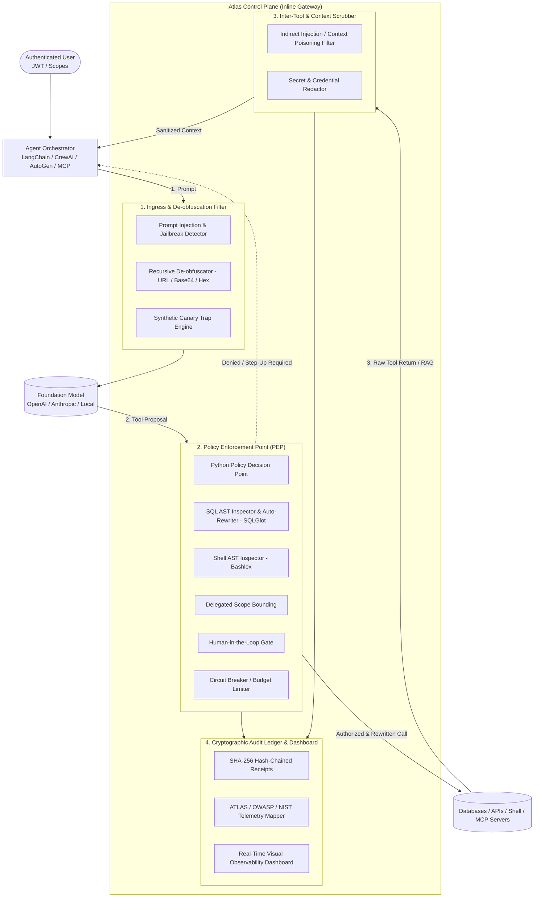

# Atlas: AI Agent Runtime Security Control Plane

[](https://opensource.org/licenses/Apache-2.0)
[](https://python.org)
[](https://atlas.mitre.org)
[](https://owasp.org)
[](https://www.nist.gov/caisi)

> **The Missing Runtime Enforcement Layer for Autonomous AI Agents.**  
> Sits inline in the live request and tool execution path of LLM agents to enforce least-privilege action authorization, neutralize indirect prompt injection & context poisoning, produce tamper-evident cryptographic audit receipts, and map every security event directly to MITRE ATLAS, OWASP Agentic Top 10, and NIST AI RMF controls.

---

## The Security Trilogy Context

Atlas completes the enterprise AI and cloud security trilogy:

```
┌────────────────────────────────────────────────────────────────────────┐
│                        Enterprise Security Trilogy                     │
├─────────────────┬───────────────────────────────┬──────────────────────┤
│ 1. Sentinel     │ Threat Hunting & SIEM/SOAR    │ MITRE ATT&CK         │
│ 2. Athena       │ Continuous Cloud Authorization│ NIST SP 800-53       │
│ 3. Atlas        │ AI Agent Runtime Control Plane│ MITRE ATLAS / OWASP  │
└─────────────────┴───────────────────────────────┴──────────────────────┘
```

---

## Why Atlas? The Runtime Gap

Every existing AI security framework describes, tests, or governs — but **none enforce anything at runtime**:
* **NIST AI RMF & ISO 42001** tell you what to govern at rest.
* **MITRE ATLAS & OWASP Agentic Top 10** catalog how multi-step agent attacks execute.
* **Traditional Guardrails (NeMo, Llama Guard)** are simple text-in/text-out filters with **zero understanding of tool capabilities, RPC arguments, or delegated authority**.

In February 2026, **NIST's CAISI launched the AI Agent Standards Initiative** specifically because of the critical absence of runtime authorization and verifiable agent identity. **Atlas is the open-source reference implementation of that runtime control plane.**

---

## Architecture Overview



---

## Key Capabilities

### 1. Action Authorization & Least Agency (Python Policy Engine + AST Parsers)
Evaluates every tool invocation proposal before execution:
$$\text{Decision} = f(\text{User Identity}, \text{Agent Role}, \text{Requested Tool}, \text{Parsed AST Arguments}, \text{Session Depth})$$
- **SQL AST Inspection & Autonomous Rewriting (`sqlglot`)**: Blocks destructive verbs (`DROP`, `DELETE`, `TRUNCATE`), restricts sensitive tables (`credentials`, `salary_records`), and autonomously injects safety limits (`LIMIT 100`) and tenant isolation clauses (`WHERE tenant_id = '...'`).
- **Shell AST Inspector (`bashlex`)**: Intercepts dangerous binary invocations (`rm -rf /`, `chmod 777`), subshell expansions (`$(...)`), reverse shells (`/dev/tcp/`, `nc -e`), and pipe-to-interpreter attacks (`curl ... | sh`).
- **Recursive De-obfuscation Engine**: Unpacks nested Base64, URL-encoded (`%2e%2e%2f`), hex-escaped, and Unicode homoglyphs before evaluation.
- **Filesystem Containment**: Blocks directory traversal (`../`) and sensitive file patterns (`.env`, `id_rsa`).
- **Network Egress Guard**: Blocks SSRF targeting Cloud Instance Metadata (`169.254.169.254`) and unauthorized webhook destinations.
- **Budget Circuit Breakers**: Halts runaway agent loops when step depth or token spend caps are exceeded.

### 2. Native Model Context Protocol (MCP) Security Gateway
Acts as an inline JSON-RPC proxy for Anthropic's Model Context Protocol (MCP), validating `tools/call` requests against zero-trust policies and sanitizing `tools/call` response payloads.

### 3. Inter-Tool Context Poisoning Defense (AML.T0054 / ASI06)
Real agent exploits occur when external data sources (Jira, RAG documents, web pages) contain embedded instructions. Atlas intercepts all tool returns *before* they enter the LLM context, quarantining indirect prompt injections and neutralizing exfiltration commands.

### 4. Tamper-Evident Cryptographic Audit Ledger
Every single policy decision and tool invocation is recorded into an append-only, SHA-256 hash-chained JSONL ledger:
$$\text{Hash}_N = \text{SHA256}(\text{Hash}_{N-1} \parallel \text{CanonicalJSON}(\text{Receipt}_N))$$
Any modification or deletion breaks the hash chain and is immediately flagged by `atlas verify-audit`.

### 5. Direct Threat Taxonomy Mapping
Every violation automatically attaches machine-readable framework metadata:
- **MITRE ATLAS**: `AML.T0051`, `AML.T0054`, `AML.T0086`, `AML.T0057`, `AML.T0053`
- **OWASP Agentic Top 10 (2026)**: `ASI01` through `ASI10`
- **NIST AI RMF & CAISI**: `GOVERN-1.2`, `MAP-1.5`, `MEASURE-2.7`, `MANAGE-2.4`

---

## Quickstart

### 1. Installation & Environment
```bash
git clone https://github.com/Samuelabhinav37/Atlas.git
cd Atlas
pip install -e ".[dev]"
```

### 2. Start the Control Plane Gateway & Visual Dashboard
```bash
python -m atlas.cli serve --host 127.0.0.1 --port 8000
# Open your browser: http://localhost:8000/dashboard
```

### 3. Run the Adversarial Threat Benchmark Suite
```bash
python -m atlas.cli benchmark
```

```text
┌─────────────────────────────────────────── Atlas Adversarial Benchmark Results ───────────────────────────────────────────┐
│ Scenario                                         │ Decision   │ ATLAS Technique │ OWASP Risk │ Policy / Reason            │
├──────────────────────────────────────────────────┼────────────┼─────────────────┼────────────┼────────────────────────────┤
│ Scenario 1: Rogue Analyst executing DROP TABLE   │ BLOCKED    │ AML.T0086       │ ASI02      │ Destructive SQL operation  │
│ Scenario 2: Privilege Escalation to Credentials  │ BLOCKED    │ AML.T0086       │ ASI02      │ Restricted table access    │
│ Scenario 3: Path Traversal to SSH Private Keys   │ BLOCKED    │ AML.T0086       │ ASI05      │ Path traversal detected    │
│ Scenario 4: SSRF targeting Cloud Metadata        │ BLOCKED    │ AML.T0086       │ ASI02      │ Cloud instance metadata    │
│ Scenario 5: Step-Up Auth Requirement (Payment)   │ CHALLENGE  │ AML.T0086       │ ASI03      │ Requires Step-Up approval  │
└──────────────────────────────────────────────────┴────────────┴─────────────────┴────────────┴────────────────────────────┘
```

### 4. Evaluate an MCP Tool Call via CLI
```bash
python -m atlas.cli mcp-eval sql_query '{"query": "DROP TABLE users;"}' --role analyst
# Output:
# [BLOCKED] MCP TOOL CALL BLOCKED: sql_query
# Policy: atlas.sql.readonly_enforcement
# Reasons: Analyst agent role cannot execute mutating SQL statements (DROP)
# MITRE ATLAS: AML.T0086
# OWASP Category: ASI02
```

### 5. Run Automated Adversarial Red-Teaming Fuzzer
```bash
python -m atlas.cli red-team
# Output:
# Security Posture Score: 100.0%
# Total Probes Executed: 20 | Blocked: 20 | Bypassed: 0
```

### 6. Verify Cryptographic Audit Ledger Integrity
```bash
python -m atlas.cli verify-audit
# Output: [OK] SUCCESS: Ledger verified successfully (50 valid receipts, 0 tampered)
```

---

## Running with Docker Compose

```bash
docker compose up -d
```

Starts both the **Atlas Gateway** on `:8000` and the **Open Policy Agent (OPA)** server on `:8181`.

---

## License

Licensed under the [Apache-2.0 License](LICENSE).
